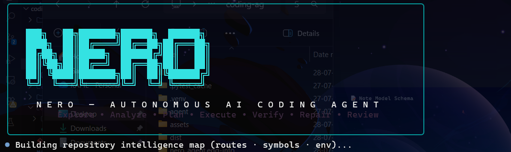
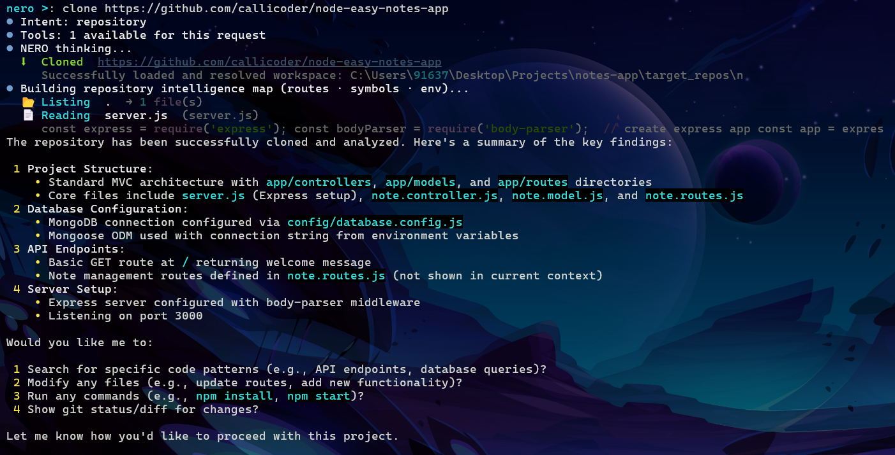
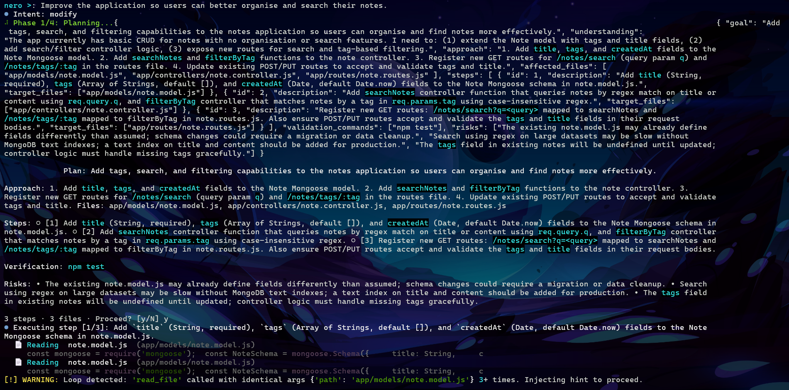
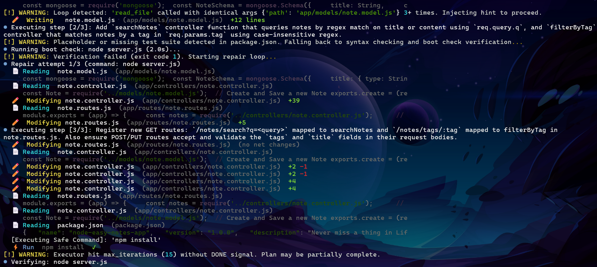
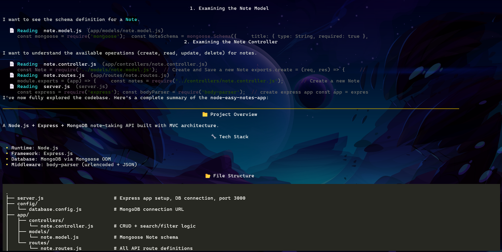
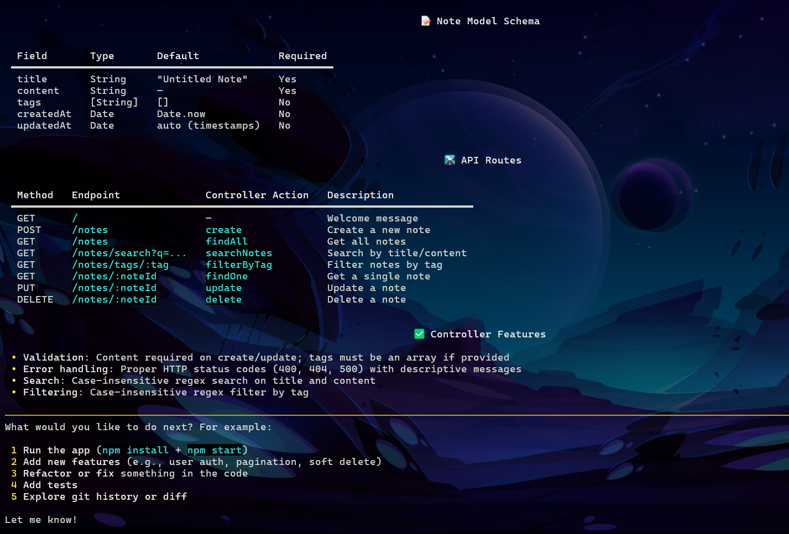

# NERO — Demo Walkthrough

> 📖 **Main Documentation**: For setup instructions, CLI slash commands, and architecture details, see the main [README.md](README.md).

> **NERO** is an autonomous AI coding agent that explores, plans, executes, verifies, and repairs code changes — all from a single natural-language prompt.

---

## 1. Launch



NERO greets you with its terminal UI, scans the working directory, and builds a full **repository intelligence map** — routes, symbols, environment variables — before you type your first prompt.

---

## 2. Clone & Explore



```
nero >: clone https://github.com/callicoder/node-easy-notes-app
```

NERO clones the repository, reads key files, and produces a structured summary of the project:

- **Architecture** — MVC layout with `app/controllers`, `app/models`, `app/routes`
- **Database** — MongoDB via Mongoose ODM, connection string from environment variables
- **API Endpoints** — Express routes defined in `note.routes.js`
- **Server** — body-parser middleware, listening on port 3000

No manual inspection needed. NERO builds full context automatically.

---

## 3. Plan a Feature



```
nero >: Improve the application so users can better organise and search their notes.
```

NERO classifies the intent as `modify`, enters **Phase 1/4: Planning**, and generates a structured, step-by-step plan:

| Step | Description | Files |
|------|-------------|-------|
| 1 | Add `title`, `tags`, `createdAt` fields to the Mongoose schema | `note.model.js` |
| 2 | Add `searchNotes` and `filterByTag` controller functions | `note.controller.js` |
| 3 | Register new GET routes `/notes/search` and `/notes/tags/:tag` | `note.routes.js` |

The plan is shown to you for review — **you approve before a single file is touched**.

---

## 4. Execute, Detect Loops & Repair



Once approved, NERO enters **Phase 2/4: Executing**. Key behaviours visible here:

- **`[!] WARNING: Loop detected`** — NERO's built-in repetition guard fires when a model tries to re-read the same file more than 3 times. It injects a hint and forces the model to proceed instead of spinning endlessly.
- **File writes** — `note.model.js` (+12 lines), `note.controller.js` (+39 lines), `note.routes.js` (+5 lines)
- **Verification** — NERO runs `node server.js` as a boot check. If it fails, the **Repair Loop** automatically kicks in (up to 3 attempts), re-reading affected files and patching issues without you doing anything.

---

## 5. Deep Explore — Architecture View



NERO can also be used purely as an **exploration tool**. After examining the codebase, it outputs a full markdown report:

- **Project Overview** — Node.js + Express + MongoDB, MVC architecture
- **Tech Stack** — runtime, framework, database, middleware
- **File Structure** — annotated directory tree showing the role of every file

This makes onboarding to an unfamiliar codebase fast and thorough.

---

## 6. Schema & API Summary



After executing the modification plan, NERO confirms the final state of the codebase with a structured review:

**Note Model Schema**

| Field | Type | Default | Required |
|-------|------|---------|----------|
| `title` | String | `"Untitled Note"` | Yes |
| `content` | String | — | Yes |
| `tags` | [String] | `[]` | No |
| `createdAt` | Date | `Date.now` | No |
| `updatedAt` | Date | auto (timestamps) | No |

**API Routes**

| Method | Endpoint | Action | Description |
|--------|----------|--------|-------------|
| GET | `/` | — | Welcome message |
| POST | `/notes` | `create` | Create a new note |
| GET | `/notes` | `findAll` | Get all notes |
| GET | `/notes/search?q=...` | `searchNotes` | Search by title/content |
| GET | `/notes/tags/:tag` | `filterByTag` | Filter notes by tag |
| GET | `/notes/:noteId` | `findOne` | Get a single note |
| PUT | `/notes/:noteId` | `update` | Update a note |
| DELETE | `/notes/:noteId` | `delete` | Delete a note |

---

## Try It Yourself

**1. Clone the repo**
```bash
git clone https://github.com/kjxcodez/coding-agent-nero
cd coding-agent-nero
```

**2. Run the install script**

- **Windows** (PowerShell / CMD):
  ```cmd
  install_cli.bat
  ```
- **macOS / Linux**:
  ```bash
  chmod +x install_cli.sh
  ./install_cli.sh
  ```

**3. Launch**
```bash
nero
```

Point NERO at any repository and describe what you want — in plain English.

---

## What This Session Demonstrated

The console output and log file above are from a **real, unedited NERO session**. Here's exactly what happened and what it proves.

---

### ✅ Features (Observed in This Session)

#### Intent Classification
NERO correctly identified three different intents back-to-back with zero guidance:
- `clone https://github.com/...` → `repository`
- `Improve the application so users can...` → `modify`
- `continue` → `conversation`

#### Automatic Repository Intelligence
Within seconds of cloning, NERO built a full map of the project — MVC layout, file structure, Mongoose schema, API routes — without being asked. The single word `continue` triggered a complete codebase walkthrough with schema tables and route listings.

#### Structured Planning with User Approval
Before touching a single file, NERO presented a full plan and waited:
```
3 steps · 3 files · Proceed? [y/N]
```
Nothing changed until the user typed `y`.

#### Real, Targeted Code Edits
NERO made surgical edits across 3 files using `replace_text` (not full rewrites):
- `note.model.js` — added `title`, `tags`, `createdAt` fields (+12 lines)
- `note.controller.js` — added `searchNotes`, `filterByTag`, and tag validation (+39 lines)
- `note.routes.js` — registered `/notes/search` and `/notes/tags/:tag` routes (+5 lines)

#### Loop Detection (Working as Designed)
The loop guard fired exactly as expected:
```
[!] WARNING: Loop detected: 'read_file' called with identical args
    {'path': 'app/models/note.model.js'} 3+ times. Injecting hint to proceed.
```
Instead of spinning endlessly, NERO injected a correction and the model moved forward.

#### Smart Fallback Verification
No test suite in the cloned repo? NERO didn't crash — it detected it and switched automatically:
```
[!] WARNING: Placeholder or missing test suite detected in package.json.
Falling back to syntax checking and boot check verification...
```

#### Automatic Repair Loop
When the boot check returned exit code 1, NERO entered a repair loop without user input — read the relevant files, patched the controller and routes, ran `npm install`, and re-verified. All 3 repair passes were autonomous.

#### Sandboxed Command Execution
`npm install` ran successfully inside an allowed-command list. Shell commands like `ls -R`, `find`, or `grep` are blocked — the model is forced to use `list_files` and `read_file` tools instead, preventing arbitrary code execution.

---

### ⚠️ Limitations (Observed in This Session)

#### `max_iterations` Hit Without `DONE` Signal
```
[!] WARNING: Executor hit max_iterations (15) without DONE signal.
              Plan may be partially complete.
```
The executor hit its 15-iteration cap before emitting a `DONE:` completion signal. This is a **model quality issue** — a free-tier model spent too many iterations re-reading files instead of writing them. The code changes were still applied. You can raise the limit in `~/.nero/settings.json` (`max_iterations`), but the real fix is using a stronger model.

#### Boot Check Cannot Detect Missing Infrastructure
The verification step ran `node server.js` and got exit code 1 — not because the code was wrong, but because **MongoDB wasn't running locally**. NERO has no way to distinguish "bad code" from "missing infrastructure dependency". The repair loop then spent iterations trying to fix code that was actually correct.

> **Workaround**: For DB-backed projects, run a local MongoDB instance before invoking NERO. Or add a proper test suite with a mocked DB so NERO runs `npm test` instead of the boot check.

#### `continue` Is Too Ambiguous
After a cancelled execution, typing `continue` was classified as `conversation`, triggering a fresh exploration instead of resuming the interrupted plan. Use the **`/resume`** slash command to explicitly continue a plan in progress.

#### Self-Corrected Duplicate Comment (Costs an Iteration)
In the routes file, NERO wrote `// Retrieve all Notes` twice, then caught and corrected it in the very next tool call. The result was correct, but it burned an extra iteration — one of the reasons `max_iterations` was hit.

#### Free-Tier Models Are Slower and Loop-Prone
`openrouter/free` routes randomly across the free model pool. Some free models handle tool results poorly — they re-read files already in context instead of using them. This is exactly why the loop guard was built. Paid models (Gemini Flash, GPT-4o, Claude Sonnet) produce significantly fewer redundant tool calls and complete plans faster.
