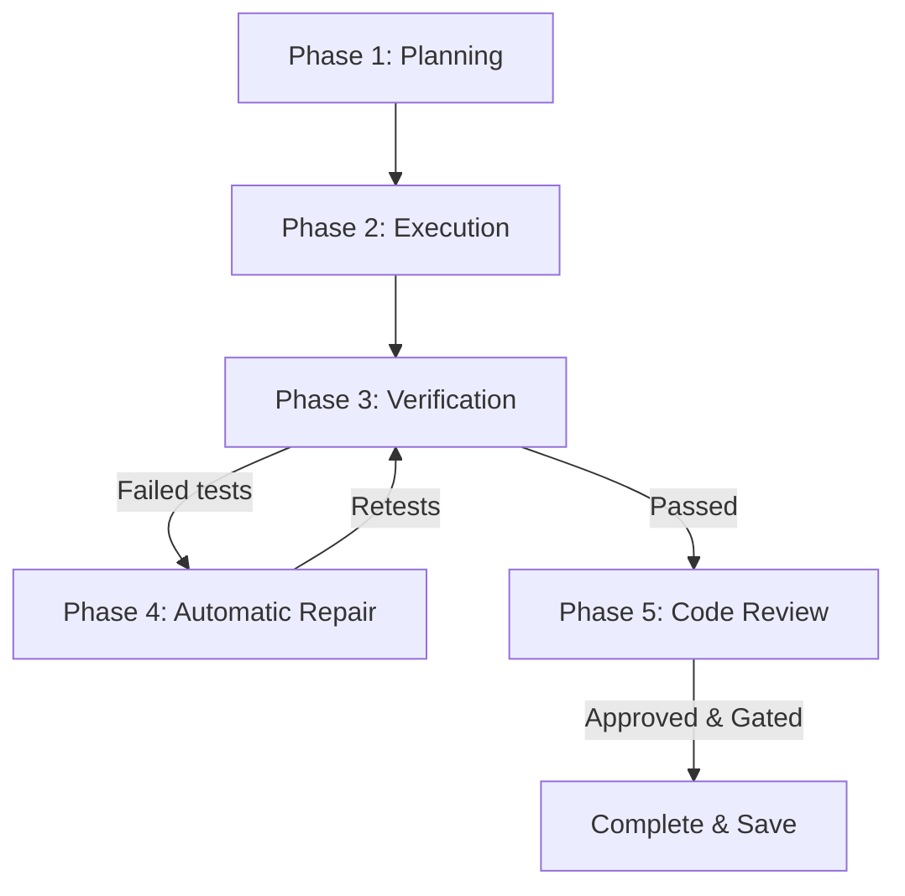

# NERO (Evolution Edition) — Autonomous AI Coding Agent CLI

NERO is an autonomous, agentic command-line assistant designed to analyze, modify, repair, and verify software codebases. It executes a complete planning-execution-verification-review lifecycle directly in your terminal, communicating with leading LLM providers (Google Gemini, OpenAI, Anthropic, and OpenRouter).

---

## Key Features

- **Interactive Onboarding**: Automatic API credential setup and model selection on first launch.
- **Verification Game Protection (Anti-Reward Hacking)**: Strict constraints blocking the AI coder from editing test configuration files (like `package.json` test scripts) to cheat validation.
- **Smart Fallback Verification**: If a repository doesn't have a test suite configured, NERO automatically runs:
  1. Syntax check validation (e.g. `node -c` for Javascript files).
  2. Subprocess boot check (starts the app/server for 2.0s to confirm it runs without crashing).
- **Workspace Privacy & Hallucination Prevention**: Automatically masks absolute host paths (e.g., `C:\Users\username\...`) to protect user identity and prevent the LLM from confabulating remote repository URLs.
- **Scoped Sandbox Tooling**: Prevents structural errors by disabling repository cloning (`clone_repo`) once the workspace is running.
- **Full State Introspection REPL**: Instant commands to query routes, codebase architecture, symbol indices, and logs.

---

## Installation

### Prerequisites
- Python >= 3.8
- Git (system path)
- Node.js (optional, for syntax/boot fallbacks on Node codebases)

### 1. Clone & Set Up Virtual Env
Clone this repository to your local system and navigate to the project directory:
```bash
git clone <repository-url>
cd coding-agent-nero

# Create and activate virtual environment
python -m venv .venv
# On Windows:
.venv\Scripts\activate
# On macOS/Linux:
source .venv/bin/activate
```

### 2. Run the Installation Script
NERO can be installed globally/locally in editable mode so the `nero` command is available anywhere on your system.

- **Windows (PowerShell/CMD)**:
  ```cmd
  install_cli.bat
  ```
- **macOS/Linux**:
  ```bash
  chmod +x install_cli.sh
  ./install_cli.sh
  ```

Alternatively, you can manually install it in editable mode:
```bash
pip install -e .
```

---

## Quick Start

### 1. Run NERO
Launch NERO directly in your terminal. You can specify a local folder or a Git URL:
```bash
# Start NERO in the current directory
nero

# Start NERO and clone/open a specific repository
nero https://github.com/callicoder/node-easy-notes-app
```

### 2. Onboarding Flow
On your first run, NERO guides you through an interactive setup:
1. Select your preferred LLM Provider (Google Gemini, OpenAI, Anthropic, or OpenRouter).
2. Enter your API Key (which is verified with a test connection).
3. Select your default models.
4. Settings are stored globally at `~/.nero/settings.json` and API keys are stored in `~/.nero/credentials.json`.

---

## Slash Commands

Within the NERO shell (`nero >:`), you can run the following built-in commands:

| Command | Description |
|---|---|
| `/help` | Display the commands panel and shortcuts. |
| `/status` / `/memory` | View active workspace paths, turns, edits log, and cache state. |
| `/diff` | View active git modifications made in this session. |
| `/undo` | Roll back all local edits and restore the repo to the git baseline. |
| `/plan` | View details of the active task modification plan. |
| `/resume` | View details of the active task modification plan and resume execution. |
| `/architecture` | View the structural map of the repository (Models, Controllers, Entrypoints). |
| `/routes` | List all detected API endpoints (supports Express.js, FastAPI, Flask, Django, etc.). |
| `/symbols <query>` | Query the indexed code symbols (classes, functions, methods). |
| `/model [name]` | View active LLM chain configurations or dynamically switch model providers. |
| `/logs [session_id/view]` | View active session logs or list history files from `~/.nero/logs/`. |

---

## The Execution Pipeline

When you ask NERO to make a change (e.g. *"add tags support to the POST endpoint"*), NERO triggers a robust 4-phase lifecycle:



1. **Planning**: NERO analyzes the workspace and drafts an incremental list of modification steps.
2. **Execution**: The Coder agent runs file editing tools (`replace_text`, `write_file`) step-by-step.
3. **Verification**: NERO runs the project test suite or fallbacks (syntax + boot checks).
4. **Repair**: If tests fail, the Repair Controller triggers a repair loop to fix errors.
5. **Review**: The Reviewer Agent audits the code changes against the user intent, pending steps, and repair logs, approving or disapproving the work.

---

## Running Tests

To verify that the NERO CLI itself is functioning correctly, run the unit test suite:
```bash
python -m pytest tests/
```
All 59 unit tests cover safety gates, memory caching, syntax detection, and pipeline executions.

---

## Contributing & License

Contributions are highly welcome! Please check out [CONTRIBUTING.md](file:///C:/Users/91637/Desktop/Projects/coding-agent-nero/CONTRIBUTING.md) for guidelines.

This project is licensed under the MIT License — see the [LICENSE](file:///C:/Users/91637/Desktop/Projects/coding-agent-nero/LICENSE) file for details.

### 💸 API Budget Disclaimer / Sponsor Call
Google Gemini and OpenRouter integrations are fully tested and verified. However, **no money** was left to verify OpenAI and Anthropic integrations (our developer pockets are dry!). If you want to sponsor our API keys or verify those providers for us, check out the disclaimer in [CONTRIBUTING.md](file:///C:/Users/91637/Desktop/Projects/coding-agent-nero/CONTRIBUTING.md)!
